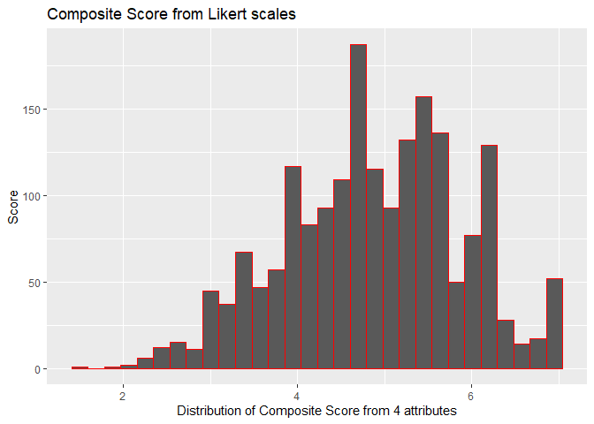
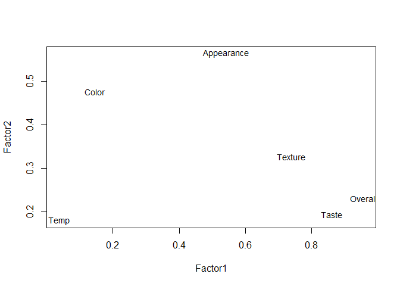

## Matt Ketterer
### Education
Applied Statistics, Master's Dec. 2024

Chemistry, B.S.
Minor in Mathematics
### Projects
#### Coast Guard Boating Accident Reporting Database (BARD) Shiny app and visualizations

* [Shiny interactive map](https://matt-k.shinyapps.io/mapshiny/)
#### Behavioral Risk Factor Surveillance System 
Metropolitan SMART BRFSS
A comparison of US metropolitan and micropolitan statistical areas (MMSA) health indicators utilizing BRFSS and Census data Survey package in R. 

*[French Fry dataset](cheese.md)*

