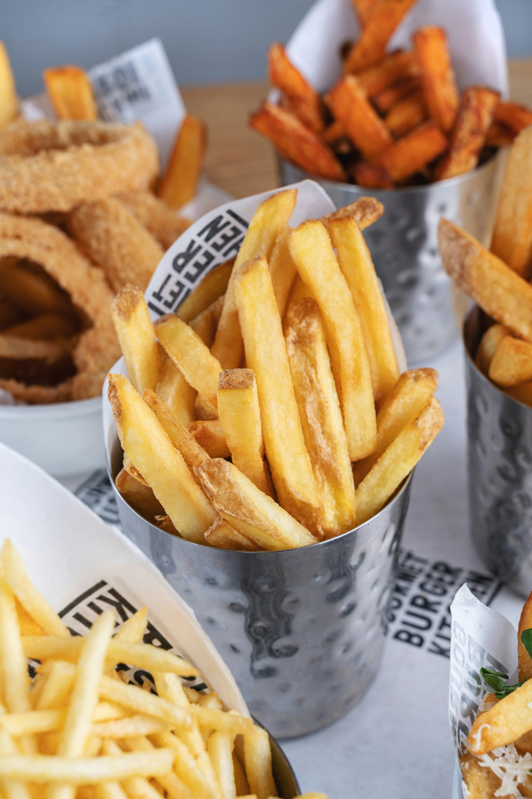

# Matt Ketterer
## Education
Applied Statistics, Master's Dec. 2024

Chemistry, B.S.
Minor in Mathematics
### Projects
#### Coast Guard Boating Accident Reporting Database (BARD) Shiny app and visualizations
The department of homeland security maintains a current deidentified access database available by FOIA request for data analysis. It contains many variables of interest, including information of vessel type, pfd usage, alcohol involvement, excessive speed, weather and many other factors. The interactive shiny application link below shows locations of these accidents on a US map using Leaflet with a filterable and selectable table table. While the database does contain latitude and longitude for some records, others can be augmented using a lookup service such as geonames.org

 [Shiny interactive map](https://matt-k.shinyapps.io/mapshiny/)

#### Brands of Oil in French Fries
 
 *[link to analysis](cheese.md)*

EDA using Likert survey results and feature engineering a normally distributed response to compare brands of oil in an ANOVA

