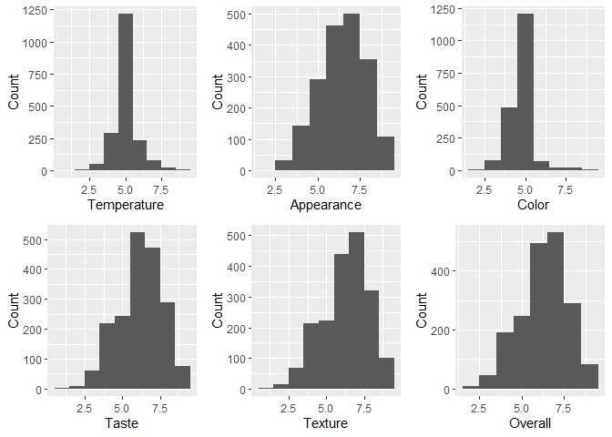
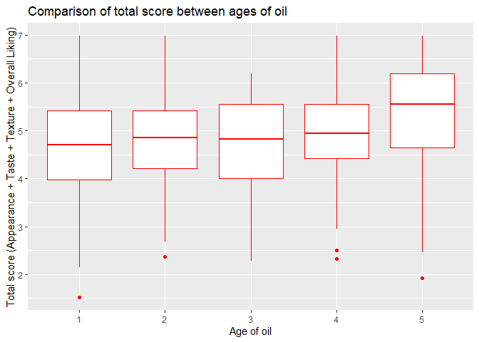
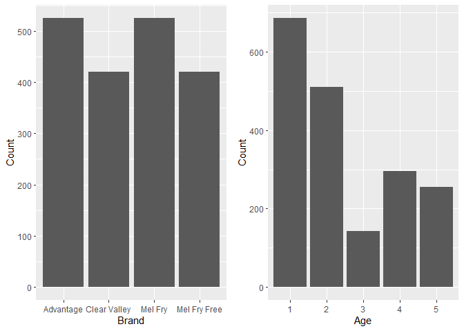
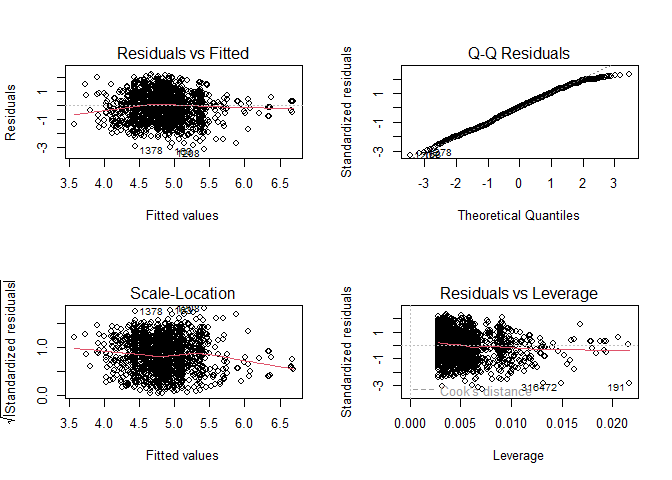
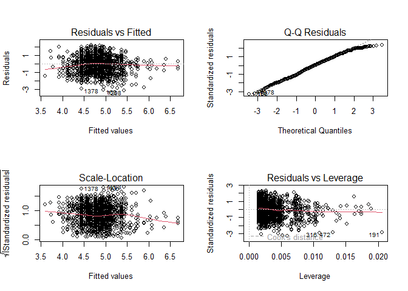
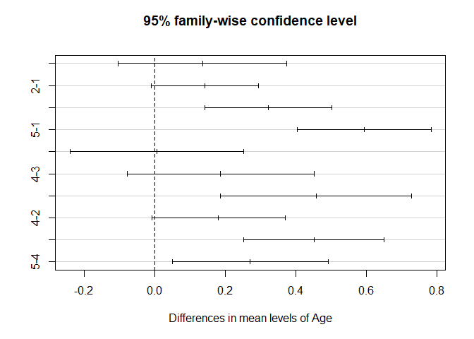
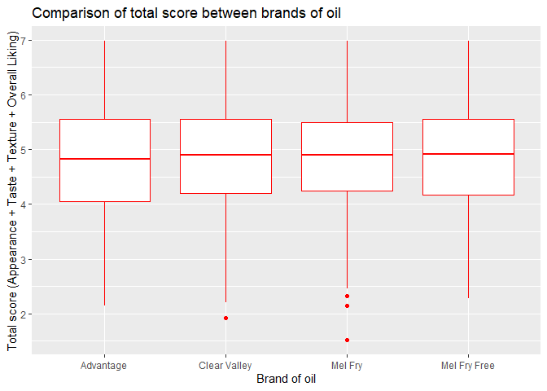
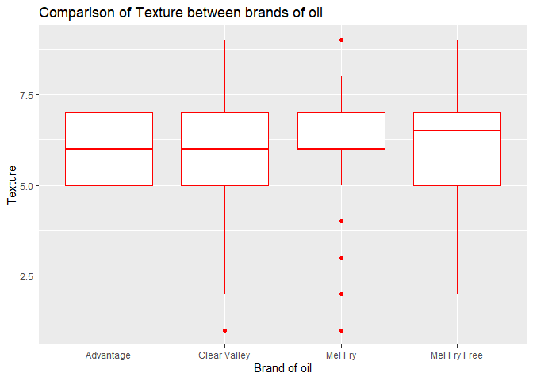
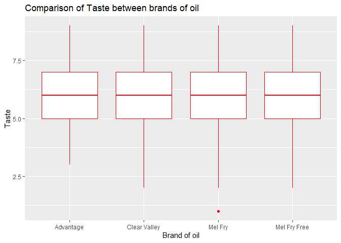
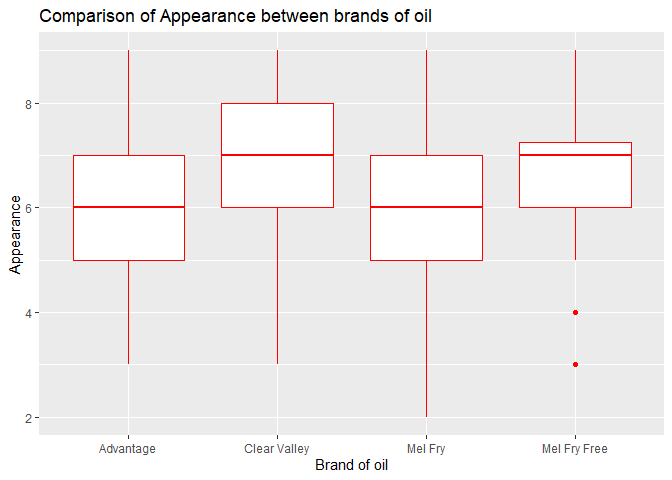

[<back](README.md)

## Appendix Project 1- French Fry Dataset

##Load in Data

``` r
library(rio)
data_list <- import_list( "C:\\Users\\mkett\\Downloads\\FrenchFryData_CleanForAnalysis.xlsx", setclass = "tbl", rbind = TRUE)
head(data_list)
```

    ## # A tibble: 6 × 16
    ##   `Samp-Set` `Time-Stamp`        `Samp-Code` `Samp-Desc` `Samp-Pos` Gender   Age
    ##        <dbl> <dttm>                    <dbl> <chr>            <dbl>  <dbl> <dbl>
    ## 1          1 2014-01-14 09:51:00         102 Mel Fry Fr…          1      2     2
    ## 2          1 2014-01-14 09:51:00         350 Clear Vall…          2      2     2
    ## 3          2 2014-01-14 10:02:00         350 Clear Vall…          1      1     2
    ## 4          2 2014-01-14 10:02:00         102 Mel Fry Fr…          2      1     2
    ## 5          3 2014-01-14 10:04:00         350 Clear Vall…          1      1     4
    ## 6          3 2014-01-14 10:04:00         102 Mel Fry Fr…          2      1     4
    ## # ℹ 9 more variables: Temperature <dbl>, Appearance <dbl>, Color <dbl>,
    ## #   Taste <dbl>, Texture <dbl>, `Overall Liking` <dbl>, Comments <chr>,
    ## #   Preference <chr>, `_file` <int>

``` r
names(data_list)[4] <- "Brand"
names(data_list)[13]<- "Overall"

data_list$Brand<-factor(data_list$Brand)
data_list$Preference<-factor(data_list$Preference)
summary(data_list)
```

    ##     Samp-Set     Time-Stamp                       Samp-Code  
    ##  Min.   :  1   Min.   :2014-01-14 09:51:00.00   Min.   :102  
    ##  1st Qu.: 24   1st Qu.:2014-01-23 10:03:00.00   1st Qu.:102  
    ##  Median : 48   Median :2014-01-29 10:59:00.00   Median :226  
    ##  Mean   : 49   Mean   :2014-01-30 16:33:41.21   Mean   :226  
    ##  3rd Qu.: 71   3rd Qu.:2014-02-07 11:26:00.00   3rd Qu.:350  
    ##  Max.   :124   Max.   :2014-02-17 12:32:00.00   Max.   :350  
    ##           Brand        Samp-Pos       Gender           Age       
    ##  Advantage   :525   Min.   :1.0   Min.   :1.000   Min.   :1.000  
    ##  Clear Valley:420   1st Qu.:1.0   1st Qu.:1.000   1st Qu.:1.000  
    ##  Mel Fry     :525   Median :1.5   Median :2.000   Median :2.000  
    ##  Mel Fry Free:420   Mean   :1.5   Mean   :1.512   Mean   :2.432  
    ##                     3rd Qu.:2.0   3rd Qu.:2.000   3rd Qu.:4.000  
    ##                     Max.   :2.0   Max.   :2.000   Max.   :5.000  
    ##   Temperature      Appearance        Color           Taste      
    ##  Min.   :1.000   Min.   :2.000   Min.   :2.000   Min.   :1.000  
    ##  1st Qu.:5.000   1st Qu.:6.000   1st Qu.:4.000   1st Qu.:5.000  
    ##  Median :5.000   Median :7.000   Median :5.000   Median :6.000  
    ##  Mean   :5.028   Mean   :6.456   Mean   :4.759   Mean   :6.191  
    ##  3rd Qu.:5.000   3rd Qu.:7.000   3rd Qu.:5.000   3rd Qu.:7.000  
    ##  Max.   :9.000   Max.   :9.000   Max.   :9.000   Max.   :9.000  
    ##     Texture         Overall        Comments                   Preference 
    ##  Min.   :1.000   Min.   :2.000   Length:1890        Advantage      :424  
    ##  1st Qu.:5.000   1st Qu.:5.000   Class :character   Clear Valley   :318  
    ##  Median :6.000   Median :6.000   Mode  :character   Mel Fry        :420  
    ##  Mean   :6.279   Mean   :6.292                      Mel Fry Free   :330  
    ##  3rd Qu.:7.000   3rd Qu.:7.000                      NeitherMFFnorCV:192  
    ##  Max.   :9.000   Max.   :9.000                      NeitherMFnorAdv:206  
    ##      _file       
    ##  Min.   : 1.000  
    ##  1st Qu.: 4.000  
    ##  Median : 6.000  
    ##  Mean   : 5.787  
    ##  3rd Qu.: 8.000  
    ##  Max.   :10.000

``` r
set1_fry<-data_list[which(data_list$Brand == "Clear Valley" | data_list$Brand == "Mel Fry Free"),]
set2_fry<-data_list[which(data_list$Brand == "Advantage" | data_list$Brand == "Mel Fry"),]

full <-data_list
full$Age<-factor(full$Age)


head(full)
```

    ## # A tibble: 6 × 16
    ##   `Samp-Set` `Time-Stamp`        `Samp-Code` Brand       `Samp-Pos` Gender Age  
    ##        <dbl> <dttm>                    <dbl> <fct>            <dbl>  <dbl> <fct>
    ## 1          1 2014-01-14 09:51:00         102 Mel Fry Fr…          1      2 2    
    ## 2          1 2014-01-14 09:51:00         350 Clear Vall…          2      2 2    
    ## 3          2 2014-01-14 10:02:00         350 Clear Vall…          1      1 2    
    ## 4          2 2014-01-14 10:02:00         102 Mel Fry Fr…          2      1 2    
    ## 5          3 2014-01-14 10:04:00         350 Clear Vall…          1      1 4    
    ## 6          3 2014-01-14 10:04:00         102 Mel Fry Fr…          2      1 4    
    ## # ℹ 9 more variables: Temperature <dbl>, Appearance <dbl>, Color <dbl>,
    ## #   Taste <dbl>, Texture <dbl>, Overall <dbl>, Comments <chr>,
    ## #   Preference <fct>, `_file` <int>

##Figure 1 - histogram of attributes

``` r
library(ggplot2)
list<-lapply(8:13,function(col) ggplot2::qplot(full[[col]], xlab=names(full[col]),ylab="Count", geom="histogram",binwidth=1))
```

    ## Warning: `qplot()` was deprecated in ggplot2 3.4.0.
    ## This warning is displayed once every 8 hours.
    ## Call `lifecycle::last_lifecycle_warnings()` to see where this warning was
    ## generated.

``` r
cowplot::plot_grid(plotlist = list)
```



\#‘Normalizing’ Attribute Vars ##Determining which attributes to combine

``` r
full$Temperature<-as.numeric(full$Temperature)
full$Appearance<-as.numeric(full$Appearance)
full$Color<-as.numeric(full$Color)
full$Taste<-as.numeric(full$Taste)
full$Texture<-as.numeric(full$Texture)
full$Overall<-as.numeric(full$Overall)
 m1 = cbind(full$Taste, full$Overall, full$Texture, full$Appearance,full$Color, full$Temperature)
 names(m1)= c("Taste", "Overall", "Texture", "Appearance", "Color", "Temp")
res = factanal(m1, factors = 2, scores = "regression", rotation = "varimax")
print(res,sort=TRUE)
```

    ## 
    ## Call:
    ## factanal(x = m1, factors = 2, scores = "regression", rotation = "varimax")
    ## 
    ## Uniquenesses:
    ## [1] 0.222 0.031 0.349 0.387 0.752 0.967
    ## 
    ## Loadings:
    ##      Factor1 Factor2
    ## [1,] 0.860   0.194  
    ## [2,] 0.957   0.231  
    ## [3,] 0.737   0.328  
    ## [4,] 0.543   0.564  
    ## [5,] 0.146   0.476  
    ## [6,]         0.179  
    ## 
    ##                Factor1 Factor2
    ## SS loadings      2.516   0.776
    ## Proportion Var   0.419   0.129
    ## Cumulative Var   0.419   0.549
    ## 
    ## Test of the hypothesis that 2 factors are sufficient.
    ## The chi square statistic is 10.52 on 4 degrees of freedom.
    ## The p-value is 0.0326

``` r
load <-res$loadings[,1:2]
```

##Figure 2- Factor plot

``` r
plot(load,type="n")
text(load,labels=names(m1),cex=0.9)
```


Attribute variables are Likert scale, difficult to transform without
changing spacing, and becuase they are zero to ten point scale could be
assumed normal if they aren’t terribly skewed. In ANOVA analysis though,
vars Appearance, Taste, Texture, and Overall Liking were summed to
produce a normal response variable that could be analyzed with ANOVA.

Combined ‘total_4’ variable (Taste +Appearance + Texture + Overall
Liking for each observation) ##Figure 3- histogram of composite score

``` r
full$total_4 <-((0.5*full$Appearance + 0.9*full$Taste + 0.7*full$Texture + full$Overall)/4)
library(ggplot2)
library(e1071)
qplot(total_4,data=full, xlab ="Distribution of Composite Score from 4 attributes", ylab = "Score", main= "Composite Score from Likert scales",geom = "histogram",color=I("red"))
```

    ## `stat_bin()` using `bins = 30`. Pick better value with `binwidth`.


``` r
skewness(full$total_4)
```

    ## [1] -0.1657151

``` r
kurtosis(full$total_4)
```

    ## [1] -0.3845681

``` r
median(full$total_4)
```

    ## [1] 4.9

``` r
mean(full$total_4)
```

    ## [1] 4.871892

##Figure 4 and 5 - Boxplot for Brand and Age vs. composite score

``` r
library(ggplot2)

#qplot(Age,data=full, xlab ="Age", ylab = "Count", main= "Distribution of Age factor",geom = #"bar",color=I("red"))
#qplot(Brand,data=full, xlab ="Age", ylab = "Count", main= "Distribution of Brand factor",geom #= "bar",color=I("red"))
qplot(Age,total_4,data=full, xlab ="Age of oil", ylab = "Total score (Appearance + Taste + Texture + Overall Liking)", main= "Comparison of total score between ages of oil",geom = "boxplot",color=I("red"))
```



``` r
list2<-lapply(c(4,7),function(col) ggplot2::qplot(full[[col]], xlab=names(full[col]),ylab="Count", geom="bar",binwidth=1))
```

    ## Warning in geom_bar(binwidth = 1): Ignoring unknown parameters: `binwidth`
    ## Ignoring unknown parameters: `binwidth`

``` r
cowplot::plot_grid(plotlist = list2)
```



## Anova model

``` r
full$Age<-factor(full$Age)
model=aov(total_4~Temperature + Color + Age + Brand,data=full)
summary(model)
```

    ##               Df Sum Sq Mean Sq F value   Pr(>F)    
    ## Temperature    1   14.7   14.72   16.30 5.63e-05 ***
    ## Color          1  152.3  152.29  168.58  < 2e-16 ***
    ## Age            4   74.9   18.73   20.73  < 2e-16 ***
    ## Brand          3    0.3    0.11    0.12    0.948    
    ## Residuals   1880 1698.3    0.90                     
    ## ---
    ## Signif. codes:  0 '***' 0.001 '**' 0.01 '*' 0.05 '.' 0.1 ' ' 1

``` r
lmtotal<-lm(model)
summary(lmtotal)
```

    ## 
    ## Call:
    ## lm(formula = model)
    ## 
    ## Residuals:
    ##      Min       1Q   Median       3Q      Max 
    ## -3.10109 -0.64843  0.05206  0.66443  2.17559 
    ## 
    ## Coefficients:
    ##                     Estimate Std. Error t value Pr(>|t|)    
    ## (Intercept)        2.6445760  0.1834703  14.414  < 2e-16 ***
    ## Temperature        0.0992362  0.0270036   3.675 0.000245 ***
    ## Color              0.3265775  0.0276477  11.812  < 2e-16 ***
    ## Age2               0.1491823  0.0558776   2.670 0.007655 ** 
    ## Age3               0.1425788  0.0880134   1.620 0.105407    
    ## Age4               0.3336084  0.0666796   5.003 6.17e-07 ***
    ## Age5               0.6151628  0.0712411   8.635  < 2e-16 ***
    ## BrandClear Valley -0.0293526  0.0629104  -0.467 0.640856    
    ## BrandMel Fry      -0.0007145  0.0588708  -0.012 0.990318    
    ## BrandMel Fry Free -0.0247859  0.0632760  -0.392 0.695317    
    ## ---
    ## Signif. codes:  0 '***' 0.001 '**' 0.01 '*' 0.05 '.' 0.1 ' ' 1
    ## 
    ## Residual standard error: 0.9504 on 1880 degrees of freedom
    ## Multiple R-squared:  0.1248, Adjusted R-squared:  0.1206 
    ## F-statistic:  29.8 on 9 and 1880 DF,  p-value: < 2.2e-16

``` r
op = par(mfrow = c(2, 2))
plot(model)
```



``` r
model2=aov(total_4~Temperature + Color + Age,data=full)
summary(model2)
```

    ##               Df Sum Sq Mean Sq F value   Pr(>F)    
    ## Temperature    1   14.7   14.72   16.32 5.56e-05 ***
    ## Color          1  152.3  152.29  168.82  < 2e-16 ***
    ## Age            4   74.9   18.73   20.76  < 2e-16 ***
    ## Residuals   1883 1698.6    0.90                     
    ## ---
    ## Signif. codes:  0 '***' 0.001 '**' 0.01 '*' 0.05 '.' 0.1 ' ' 1

``` r
lmtotal2<-lm(model2)
summary(lmtotal2)
```

    ## 
    ## Call:
    ## lm(formula = model2)
    ## 
    ## Residuals:
    ##      Min       1Q   Median       3Q      Max 
    ## -3.09380 -0.64702  0.05236  0.66115  2.18367 
    ## 
    ## Coefficients:
    ##             Estimate Std. Error t value Pr(>|t|)    
    ## (Intercept)  2.63891    0.18206  14.495  < 2e-16 ***
    ## Temperature  0.09751    0.02669   3.653 0.000266 ***
    ## Color        0.32748    0.02758  11.873  < 2e-16 ***
    ## Age2         0.14780    0.05579   2.649 0.008132 ** 
    ## Age3         0.13877    0.08772   1.582 0.113817    
    ## Age4         0.32949    0.06627   4.972 7.23e-07 ***
    ## Age5         0.60879    0.07037   8.651  < 2e-16 ***
    ## ---
    ## Signif. codes:  0 '***' 0.001 '**' 0.01 '*' 0.05 '.' 0.1 ' ' 1
    ## 
    ## Residual standard error: 0.9498 on 1883 degrees of freedom
    ## Multiple R-squared:  0.1247, Adjusted R-squared:  0.1219 
    ## F-statistic:  44.7 on 6 and 1883 DF,  p-value: < 2.2e-16

``` r
op = par(mfrow = c(2, 2))
plot(model2)
```



``` r
##Figure Tukey pairwise differences
##Results show that 2,3, and 4 are mostly the same, following boxplot above. This suggests removing 1 and 5 and ##rerunning AVOVA to see if brand has effect.
```

##Figure 6 Tukey Pairwise difference plot

``` r
op = par(mfrow = c(1, 1))
require(graphics)
library(multcompView)
```

    ## Warning: package 'multcompView' was built under R version 4.4.1

``` r
TUKEY <-TukeyHSD(model, "Age", ordered = TRUE)
```

    ## Warning in replications(paste("~", xx), data = mf): non-factors ignored:
    ## Temperature

    ## Warning in replications(paste("~", xx), data = mf): non-factors ignored: Color

``` r
plot(TUKEY)     
```



##Figure 7

``` r
library(ggplot2)
qplot(Brand,total_4,data= full, xlab ="Brand of oil", ylab = "Total score (Appearance + Taste + Texture + Overall Liking)", main= "Comparison of total score between brands of oil",geom = "boxplot",color=I("red"))
```



``` r
qplot(Brand,Texture,data= full, xlab ="Brand of oil", ylab = "Texture", main= "Comparison of Texture between brands of oil",geom = "boxplot",color=I("red"))
```



``` r
qplot(Brand,Taste,data= full, xlab ="Brand of oil", ylab = "Taste", main= "Comparison of Taste between brands of oil",geom = "boxplot",color=I("red"))
```



``` r
qplot(Brand,Appearance,data= full, xlab ="Brand of oil", ylab = "Appearance", main= "Comparison of Appearance between brands of oil",geom = "boxplot",color=I("red"))
```


